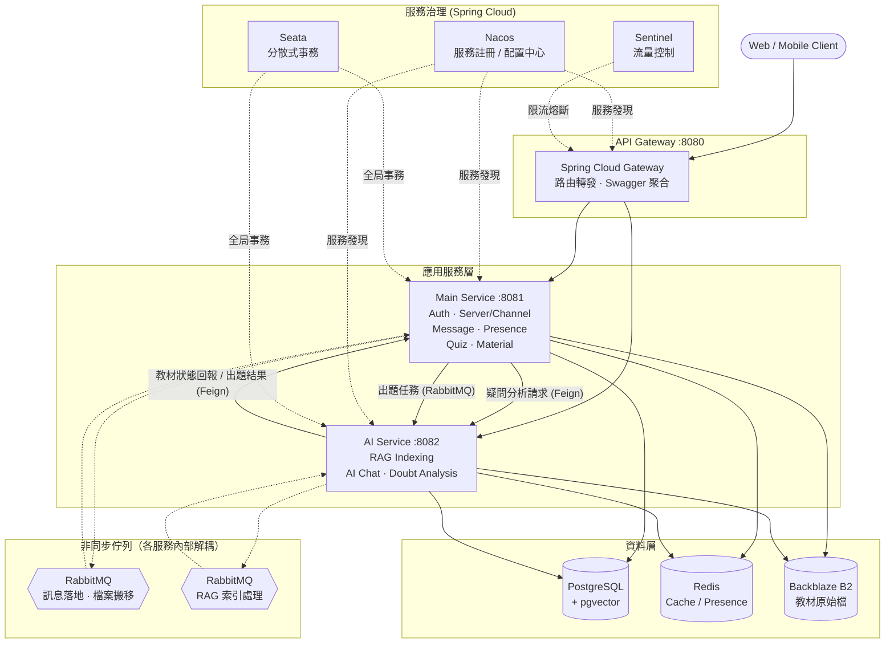
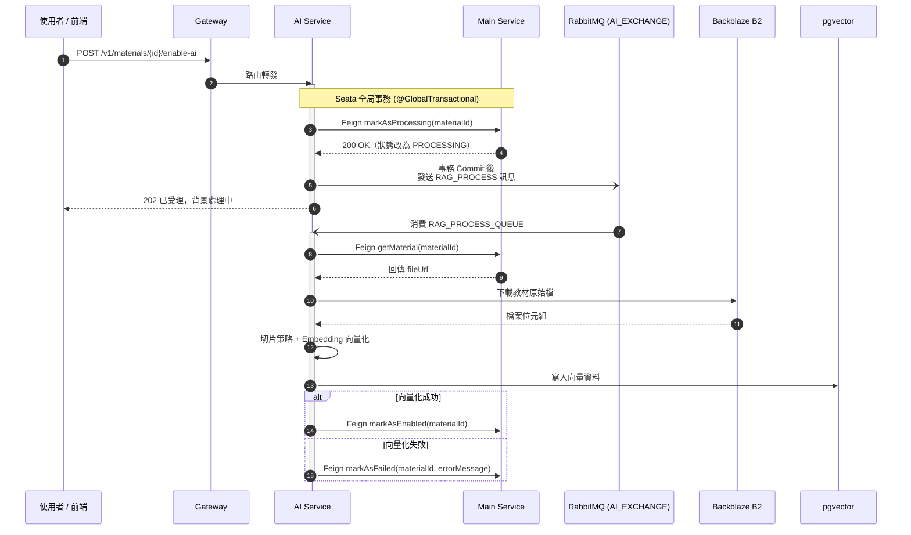

  

<b>AI 驅動的社群學習網路應用</b>

    <a href="https://classcord.hys-lab.com"><b>Website</b></a> •
    <a href=""><b>Documentation</b></a>

  

 

以「伺服器 ⭢ 頻道」為根基打造 Discord 般的即時互動體驗，自由建立班級社群、分享教材。

每份教材都能生成專屬 AI 助教，透過教材內容建立 RAG 知識索引，即時解答學生疑問、生成測驗。
系統自動彙整班級題目正確率統計數據與學生疑問焦點報告，協助領導者快速掌握班級學習狀況、精準補強教學盲點。

 

## 🌟 技術 (Technologies)
- `Java 21`
- `Spring Cloud (Nacos, Gateway, Open Feign, Sentinel, Seata)`
- `Spring AI`
- `Spring Security`
- `Spring Boot 3`
- `RabbitMQ`
- `Redis`
- `Postgres, Pgvector`
- `Docker`
- `GitHub Actions (CI / CD)`
- `Backblaze B2`
- `Flyway`

 

## 📝 功能 (Features)

- 💬 **即時社群互動**：仿 Discord 的伺服器與頻道架構，支援即時訊息與線上狀態顯示
- 📚 **教材共享**：課程教材上傳與分享
- ✨ **教材專屬 AI 助教**：針對每份教材建立 RAG 知識索引，提供即時問答
- 📊 **全班正確率統計**：AI 自動出題、批改，彙整班級錯題率與選項分佈，掌握全班學習盲點
- 💡 **學生疑問焦點報告**：AI 分析全班提問紀錄，過濾閒聊並歸納疑惑主題與教學建議
- 🏛️ **微服務架構**：Gateway + Main Service + AI Service

 

## 🏛️ 架構 (Architecture)

### 核心流程：教材啟用 AI 助教（RAG 向量化）

 

## 🔭 過程 (The Process)

我察覺到將即時社群互動（如 Discord）與透過 AI 學習相結合的可能性，於是開發了這款網路應用。

專案最初以單體架構起手，把「即時社群互動 ＋ AI 學習」的想法逐步實作出來。

隨著 AI 助教功能加入，問題也浮現：AI 服務的資源消耗（向量化、LLM 呼叫）遠高於其他模組，若和主要業務邏輯綁在同一個服務裡，耦合度太高；而且一旦 AI 服務掛掉，會直接拖垮整個網站其他功能。這讓我決定把 AI 服務獨立拆分出來。

- 首先要重新界定 AI 服務的職責邊界，把原本混在單體內的 API 重新切分出去
- 服務間溝通改用 OpenFeign，需要重新設計呼叫方式與錯誤處理機制
- 抽出 common 共用套件，決定哪些類別該放進去、哪些該留在各服務內
- docker-compose 也得整個重寫，因應多服務的啟動順序與網路設定
- CI/CD——原本單體只要建置一次，現在變成多服務分別設計 pipeline

歷經這次拆分，AI 服務具備了獨立擴展、獨立部署的能力，即使未來 AI 相關運算需求暴增，也能單獨針對該服務做集群化，而不必牽動其他核心功能；同時服務間的故障也被有效隔離，AI 服務即使異常，也不會再影響訊息、頻道等基礎互動功能的正常運作。

 

## 🚀 如何本地啟動專案 (Running the Project)
1. Clone 此專案
2. 設定 `.env`
3. `docker-compose up -d` 啟動 Postgres / Redis / RabbitMQ / Nacos / Seata 等基礎設施
4. 啟動 `Gateway`, `Main`, `Ai` 三個 Spring Boot 服務
5. 瀏覽器打開 `http://localhost:8080/swagger-ui.html` 查看 API

 

## 📎 預覽 (Preview)
[預覽影片](https://github.com/user-attachments/assets/73396abe-6b14-4c0d-80cd-74e021412652)
